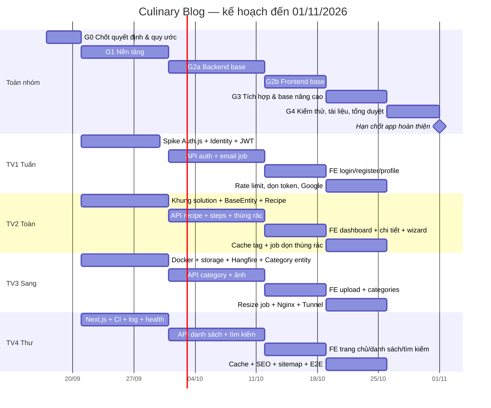

# Kế hoạch tổng thể — Culinary Blog (đồ án Phát triển Ứng dụng Web Nâng cao)

> **Thời gian:** T5 17/09/2026 → **CN 01/11/2026 — hạn chốt ra ứng dụng hoàn thiện** — 46 ngày, khoảng 6,5 tuần.
> **Căn cứ:** `SRS_Culinary_Blog_v1.0.0_GiaiPhap.md` (bản đã có ghi chú chốt của nhóm và câu trả lời của giảng viên), `SRS_Culinary_Blog_v1.0.0_DanhSachLoi.md`, `BangPhanCong.docx`.
> **Kế hoạch chi tiết từng người:** `TV1_NguyenNgocTuan_Auth-Profile.md` · `TV2_BuiNgocToan_Recipe-Core.md` · `TV3_LuongDucSang_Category-File-Image.md` · `TV4_TranLeBaoThu_Search-SEO-Observability.md`.

## 1. Thành viên và vai trò

| Mã | Thành viên | Module chính | Vai trò chung thêm |
|---|---|---|---|
| **TV1** | Nguyễn Ngọc Tuấn | Auth & Profile (FR-AUTH-001 → 007), Welcome Email (FR-JOB-001) | Điều phối tài liệu: SRS v1.1, ADR, bảng Change Request |
| **TV2** | Bùi Ngọc Toàn | Recipe Core (FR-RCP-002 → 007, 009, 010) | Nền backend: khung solution, BaseEntity, xử lý lỗi chung, hợp đồng API |
| **TV3** | Lương Đức Sang | Categories (FR-CAT), File/Storage (FR-FILE), Ảnh (FR-RCP-008, FR-JOB-002) | Hạ tầng: Docker Compose, Hangfire, Nginx, Cloudflare Tunnel |
| **TV4** | Trần Lê Bảo Thư | Danh sách & tìm kiếm (FR-RCP-001, FR-SRCH), SEO, Observability (FR-OBS) | Nền frontend (khung Next.js), CI, đo kiểm NFR |

## 2. Giả định lập kế hoạch

1. Hiện tại nhóm **chưa có code nghiệp vụ**; môi trường dev trên từng máy đã cài hoặc sẽ cài trong giai đoạn 0.
2. Mỗi người dành khoảng **15–20 giờ/tuần** (hạn 01/11 khá gấp). Có dùng Claude Code hỗ trợ.
3. **01/11 là hạn chốt để có một ứng dụng hoàn thiện**, dùng được như sản phẩm thật: đăng nhập/đăng ký chạy thật, giao diện đầy đủ và chỉn chu cho mọi trang, web gần như hoàn chỉnh từ đầu đến cuối; kèm kiểm thử các luồng chính, NFR đo được trên máy demo và SRS v1.1. Sau 01/11 chỉ còn sửa lỗi nhỏ và làm các hạng mục mở rộng ở mục 9.
4. Deadline trong các file là **cuối ngày** (23:59) và tính là "đã merge vào nhánh `main`", không phải "đang làm dở".

## 3. Các quyết định đã chốt (đầu vào của kế hoạch)

| # | Chủ đề | Quyết định | Nguồn |
|---|---|---|---|
| S-01 | Tài liệu | Phát hành **SRS v1.1** (Markdown trong repo + bảng Change Request + ADR) | GV: cho phép |
| S-03 | Xóa dữ liệu | **Phương án C (lai):** Recipe xóa mềm vào **thùng rác 30 ngày**, có khôi phục, job định kỳ xóa thật + xóa ảnh; bảng con và Category xóa thật | Nhóm chốt |
| S-04 | Concurrency | `xmin` → `uint Version`; client gửi `version` trong body; lệch → 409 | Khuyến nghị |
| S-05/06 | Xác thực | Auth.js v5 dạng BFF; refresh token xoay vòng + FamilyId + ân hạn 30 giây; dự phòng: cookie HttpOnly | Khuyến nghị |
| S-07 | Cache | Output Cache + Redis store, xóa theo tag; bật ở giai đoạn 3 | Khuyến nghị |
| S-08 | Tìm kiếm | **Phương án B:** `pg_trgm` trên cột đã bỏ dấu — **cho phép tìm tiếng Việt không dấu** | Nhóm chốt |
| S-09 | Storage & demo | Code trung lập S3; dev chạy storage trong Docker; **bản demo đưa ra Internet bằng Cloudflare Tunnel** | GV: nghiên cứu Cloudflare Tunnel |
| S-10 | Hợp đồng API | Không vỏ bọc; 422 cho validation; RFC 9457 + trường `code`; `sort=-field`; bảng đặt tên thống nhất | Khuyến nghị |
| S-11 | Publish | Chỉ cần **≥ 1 bước**; nguyên liệu và ảnh **không bắt buộc**, được bổ sung sau khi publish | GV: không bắt buộc, cho bổ sung sau |
| S-12 | Ảnh | Chỉ **JPEG, PNG, WebP** (không AVIF) | GV: không cần AVIF |
| S-14 | Sitemap & job | Sitemap sinh bằng Next.js; Hangfire recurring job dùng cho các việc dọn dẹp (thùng rác, refresh token hết hạn, file mồ côi) | GV: nhóm tự chọn |
| S-16 | NFR | Base (đo được trên máy demo) trước 01/11; mở rộng sau | GV |
| S-17 | Phạm vi | Thêm unarchive, `GET /recipes/{id}`, `GET /me/recipes`; bỏ xác nhận email, OTP, ảnh cho từng bước khỏi v1 | GV: nhóm chọn phương án tối ưu |

**Hai điểm diễn giải cần xác nhận nhanh với giảng viên (trước CN 20/09):**
- *Câu 3 (publish):* nhóm hiểu "không bắt buộc" là giữ điều kiện tối thiểu của FR-RCP-005 (≥ 1 bước). Nếu GV muốn không có điều kiện nào thì chỉ cần bỏ một kiểm tra, không ảnh hưởng kế hoạch.
- *Câu 4 (MinIO → Cloudflare Tunnel):* Tunnel dùng để **đưa bản demo từ máy nhóm ra Internet** (không cần VPS, IP tĩnh); nó **không thay thế** kho lưu ảnh. Ảnh vẫn nằm trong container storage tương thích S3, được Nginx phục vụ qua đường dẫn `/media` nên đi chung qua Tunnel.

## 4. Các mốc chính

| Mốc | Ngày | Tiêu chí hoàn thành (kiểm tra được) |
|---|---|---|
| **M0 — Chốt & chuẩn bị** | CN 20/09 | Có ADR ngắn cho các quyết định mục 3; `docs/SRS_v1.1.md` có bảng Change Request; repo có quy tắc nhánh/PR; bảng mã lỗi, `PagedResult`, bảng đặt tên đã thống nhất |
| **M1 — Nền tảng chạy** | T4 30/09 | `docker compose up` đủ service; backend 4 tầng build được, architecture test và CI xanh; migration Users/Recipes/Categories chạy; đăng nhập lấy JWT test được qua Scalar; Next.js gọi được API; Hangfire và storage hoạt động |
| **M2 — Backend base xong** | CN 11/10 | Mọi API Must của 4 module chạy qua Scalar, có test cho các nhánh chính |
| **M3 — Frontend base xong** | CN 18/10 | Luồng đầu-cuối chạy trên giao diện: đăng ký → đăng nhập → tạo recipe có ảnh → publish → hiện ở trang chủ/danh sách/danh mục/tìm kiếm → sửa → xóa vào thùng rác → khôi phục |
| **M4 — Tích hợp & chốt tính năng** | CN 25/10 | Giao diện hoàn thiện cho mọi trang (không còn placeholder, có trạng thái loading/lỗi/rỗng, dùng tốt trên điện thoại); cache, SEO base, sitemap, job resize ảnh, các job dọn dẹp, rate limit chạy; bản demo truy cập được qua Cloudflare Tunnel. **Sau mốc này không thêm tính năng** |
| **M5 — Kiểm thử & đo xong** | T5 29/10 | Integration test + E2E các luồng chính xanh; báo cáo k6/Lighthouse base; không còn lỗi mức nghiêm trọng |
| **M6 — Tài liệu & tổng duyệt** | T7 31/10 | SRS v1.1 hoàn chỉnh (TV1 tổng hợp xong T6 30/10); README; tổng duyệt demo toàn nhóm |
| **Hạn chốt — app hoàn thiện** | **CN 01/11** | Ứng dụng chạy trọn vẹn: đăng nhập, giao diện hoàn chỉnh mọi trang, dữ liệu demo; sửa lỗi cuối, gắn tag `v1.0`, nộp/báo cáo |

## 5. Lịch theo giai đoạn

| Giai đoạn | Thời gian | Mục tiêu |
|---|---|---|
| **G0** | T5 17/09 → CN 20/09 | Chốt quyết định, viết ADR, dựng repo, thống nhất hợp đồng API |
| **G1** | T2 21/09 → T4 30/09 | Nền tảng dùng chung: backend 4 tầng, Docker, JWT, khung Next.js, CI, log, entity chính |
| **G2a** | T5 01/10 → CN 11/10 | Toàn bộ API base của 4 module |
| **G2b** | T2 12/10 → CN 18/10 | Toàn bộ màn hình base, luồng đầu-cuối |
| **G3** | T2 19/10 → CN 25/10 | Cache, SEO, sitemap, job nền, rate limit, Google login (Should), Nginx + Cloudflare Tunnel; **chốt tính năng** |
| **G4** | T2 26/10 → CN 01/11 | Kiểm thử, đo NFR base, sửa lỗi, SRS v1.1, tổng duyệt, hoàn thiện |

## 6. Phụ thuộc chéo giữa các thành viên

Đây là các "điểm bàn giao" quan trọng nhất; trễ một mục sẽ kéo trễ người khác.

| Bàn giao | Người giao | Người nhận | Hạn |
|---|---|---|---|
| Repo GitHub (nhánh `main` bảo vệ, template PR) + bảng Kanban | TV4 | Cả nhóm | T6 18/09 |
| Khung solution 4 tầng build được | TV2 | TV1, TV3, TV4 | T4 23/09 |
| `docker-compose.yml` dev (PostgreSQL, Redis, storage, Mailpit, Seq) | TV3 | Cả nhóm | T5 24/09 |
| `AppDbContext` + `BaseEntity` | TV2 | TV1, TV3 | T6 25/09 |
| Entity `Category` + migration | TV3 | TV2 | T7 26/09 |
| Xử lý lỗi chung (Problem Details + bảng mã lỗi) + `PagedResult` + ValidationBehavior | TV2 | Cả nhóm | T7 26/09 |
| Khung Next.js + API client + proxy `/api` | TV4 | TV1, TV2, TV3 | T6 25/09 |
| Entity `Recipe` + migration | TV2 | TV3 (ảnh), TV4 (danh sách, tìm kiếm) | CN 27/09 |
| CI chạy trên mọi PR | TV4 | Cả nhóm | CN 27/09 |
| JWT dùng chung + user seed + `POST /auth/login` | TV1 | TV2, TV3, TV4 | T3 29/09 |
| `IFileStorage` (có `DeleteByPrefix`) | TV3 | TV2 (job dọn thùng rác) | CN 27/09 |
| Hangfire + `IBackgroundJobService` | TV3 | TV1 (email), TV2 (dọn thùng rác) | T3 29/09 |
| `ICacheInvalidator` (bản rỗng) | TV4 | TV2, TV3 | T4 30/09 |
| Auth.js session + middleware bảo vệ route | TV1 | TV2, TV3 (trang dashboard) | T6 02/10 |
| Trang `/recipes/[slug]` + DTO chi tiết | TV2 | TV4 (SEO, JSON-LD) | T5 15/10 |
| Component upload ảnh | TV3 | TV2 (wizard) | T5 15/10 |
| Output Cache thật (xóa theo tag) | TV4 | TV2, TV3 kiểm tra | T4 21/10 |
| Playwright + mẫu E2E | TV4 | TV1, TV2 | CN 25/10 |
| Link demo qua Cloudflare Tunnel | TV3 | Cả nhóm | CN 25/10 |
| Dữ liệu seed (Bogus: 50 recipe, 5 tác giả) | TV4 | Cả nhóm (demo, đo hiệu năng) | T7 10/10 |
| Phần SRS v1.1 của từng module | TV2, TV3, TV4 | TV1 | T5 29/10 |

## 7. Cách làm việc chung

**Phối hợp:** nhóm tự chủ động, không có lịch họp cố định. Mỗi người tự cập nhật tiến độ trên bảng công việc; bị chặn hoặc sắp trễ một điểm bàn giao thì báo ngay trong kênh chung của nhóm.

**Quản lý công việc:** mỗi dòng trong file kế hoạch cá nhân là một thẻ trên GitHub Projects (Kanban: Todo → Doing → Review → Done), giữ nguyên mã công việc (ví dụ `1.09`).

**Git:**
- `main` được bảo vệ, chỉ merge qua Pull Request, CI phải xanh.
- Tên nhánh: `tv1/1.09-register`, `tv2/2.08-create-recipe`…
- Mỗi PR có **một người khác review trong vòng 24 giờ**. Gợi ý cặp review chéo: TV1 ↔ TV2, TV3 ↔ TV4.
- PR đổi API thì OpenAPI tự cập nhật; đổi quy ước thì ghi vào bảng Change Request của SRS v1.1.

**Định nghĩa "Xong" (Definition of Done) cho một công việc:**
1. Code đã merge vào `main`, CI xanh.
2. Có test cho nhánh thành công và ít nhất một nhánh lỗi (với API).
3. Lỗi trả đúng Problem Details + `code` theo bảng mã lỗi.
4. Endpoint hiển thị đúng trên Scalar; màn hình chạy được với dữ liệu seed.
5. Nếu khác SRS v1.0 → đã ghi vào bảng Change Request.

## 8. Quản lý rủi ro và thứ tự cắt giảm

**Dấu hiệu và hành động:**

| Rủi ro | Dấu hiệu | Hành động |
|---|---|---|
| Nền tảng trễ | T4 30/09 chưa đạt M1 | Dừng việc riêng, cả nhóm dồn vào mục còn thiếu; lùi M2 tối đa 2 ngày, lấy lại bằng cách cắt từ danh sách dưới |
| Auth.js v5 gây vướng | T4 23/09 spike chưa refresh được | TV1 chuyển sang phương án cookie HttpOnly (S-05 B) |
| Image storage không kéo được | `docker compose pull` lỗi | TV3 chuyển sang `LocalFileStorage` cho dev; Tunnel vẫn dùng được |
| Tìm kiếm không dấu cho kết quả kém | Test tiếng Việt fail nhiều | TV4 ưu tiên khớp Title, tăng ngưỡng similarity |
| Trễ tiến độ chung | CN 18/10 chưa đạt M3 | Áp dụng thứ tự cắt giảm |

**Thứ tự cắt giảm khi thiếu thời gian** — chỉ dùng khi thật sự trễ, vì 01/11 phải ra app hoàn thiện (cắt từ trên xuống, chuyển sang "sau 01/11"):
1. Đăng nhập Google (FR-AUTH-003 — mức Should).
2. Kéo thả sắp xếp lại các bước.
3. Job dọn file mồ côi.
4. Job resize ảnh (tạm hiển thị ảnh gốc).
5. Output Cache (hệ thống vẫn đúng, chỉ chậm hơn).
6. Sitemap.

**Không được cắt:** đăng ký/đăng nhập/refresh/logout và màn hình hồ sơ; giao diện hoàn chỉnh cho mọi trang (không còn trang placeholder, có trạng thái loading/lỗi/rỗng, dùng tốt trên điện thoại); CRUD + publish + thùng rác recipe; steps/ingredients; categories; upload ảnh; danh sách + tìm kiếm; trang chi tiết; test các luồng chính; SRS v1.1.

## 9. Hướng phát triển sau 01/11 (mức mở rộng)

| Nhóm | Hạng mục | Phụ trách gợi ý |
|---|---|---|
| Xác thực | Đăng nhập Google (nếu trễ), quên/đặt lại mật khẩu, gọi API qua Route Handler proxy, quản trị người dùng (khóa/mở, gán role) | TV1 |
| Công thức | Danh sách toàn bộ recipe cho Admin, nội dung dạng Markdown, sắp xếp lại nguyên liệu, lịch sử chỉnh sửa | TV2 |
| Ảnh & hạ tầng | Ảnh Open Graph 1200×630, `docker-compose.prod.yml` đầy đủ, backup tự động, cân nhắc storage lâu dài (dịch vụ S3 khác), đưa ảnh qua cache của Cloudflare | TV3 |
| Tìm kiếm & vận hành | OpenTelemetry tracing + metrics (FR-OBS-003), kết hợp full-text `tsvector` để xếp hạng tốt hơn, tìm theo nguyên liệu, revalidate ISR theo sự kiện, CI Lighthouse | TV4 |
| NFR mở rộng | Coverage cao hơn, StyleCop/Sonar, k6 kịch bản dài, scale ngang (chỉ khi GV yêu cầu) | Cả nhóm |

## 10. Bảng theo dõi tuần (mỗi người tự cập nhật)

| Tuần | Khoảng ngày | Mốc | TV1 | TV2 | TV3 | TV4 | Ghi chú / quyết định cắt giảm |
|---|---|---|---|---|---|---|---|
| 1 | 17/09 – 20/09 | M0 | | | | | |
| 2 | 21/09 – 27/09 | — | | | | | |
| 3 | 28/09 – 04/10 | M1 (30/09) | | | | | |
| 4 | 05/10 – 11/10 | M2 | | | | | |
| 5 | 12/10 – 18/10 | M3 | | | | | |
| 6 | 19/10 – 25/10 | M4 | | | | | |
| 7 | 26/10 – 01/11 | M5, M6, hạn chốt app hoàn thiện | | | | | |

*Cách điền mỗi ô: % công việc đã Done theo file cá nhân + mã công việc đang trễ (nếu có).*
